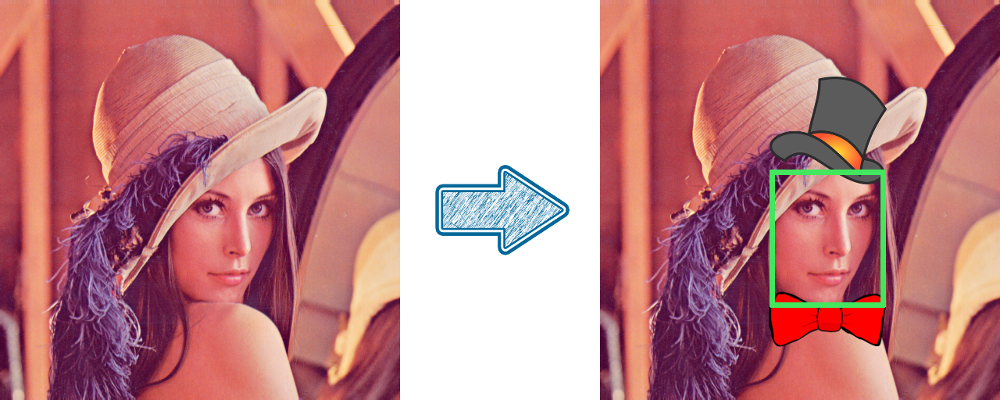

## Zazz up your webcam

Find the bounding box of your face in the webcam frame with opencv's CascadeClassifier (use the haarcascade pretrained model). Then add a bowtie to the bottom edge of the bounding box and a tophat to the upper edge.
